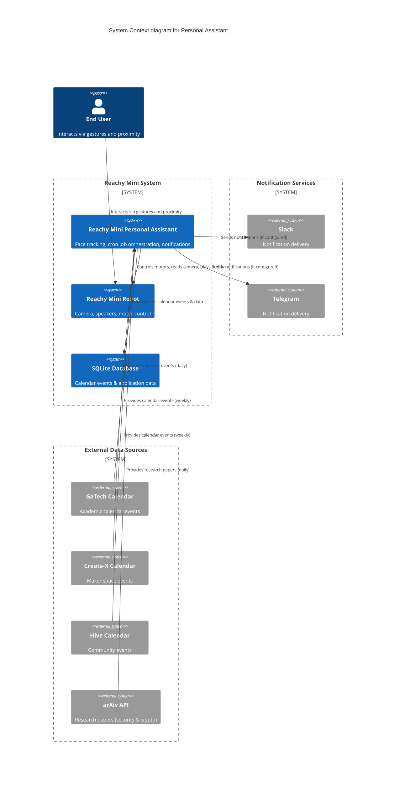

# Reachy Mini Personal Assistant

## Project Overview

The goal of this project was to create a personal assistant using the Reachy Mini robot. The assistant is designed to interact with users through voice commands and provide various services, such as answering questions, controlling smart home devices, and providing information.

To reduce the scope of the initial project, I focused on implementing the following:
- Face tracking: The robot can detect and track faces using its camera, allowing it to maintain eye contact with the user.
- Cron Job Support: The assistant will need to build some knowledge and gather information over time.  To support this, I implemented a cron job type system.  The initial cron jobs scrape calendars(gatech calendar, and create-x) and pulls the 25 new security papers from arxiv.

## Reachy Mini Overview

The Reachy Mini is a small humanoid robot developed by the French company Pollen Robotics. It is designed for research, education, and personal use. The robot features a modular design, allowing users to customize its appearance and functionality. It has a range of sensors, including cameras, and microphones, enabling it to interact with its environment and users effectively.

The Reachy Mini uses a client-server architecture, where the robot runs a server that can be controlled through a client interface. This allows for flexibility in programming and integration with various services and applications:
