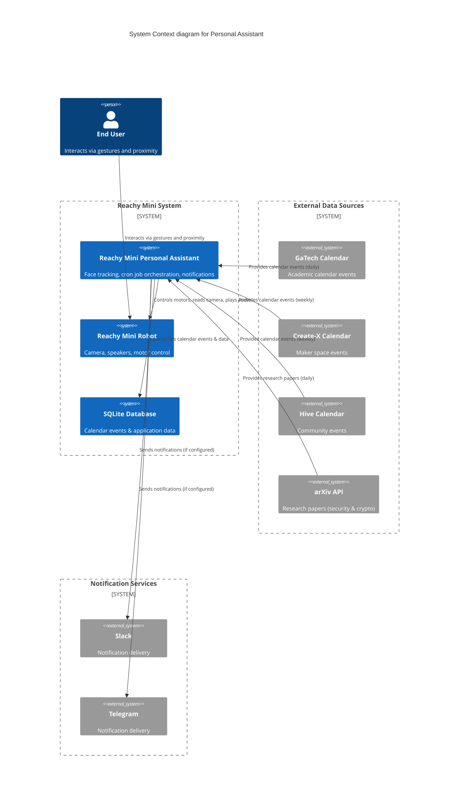
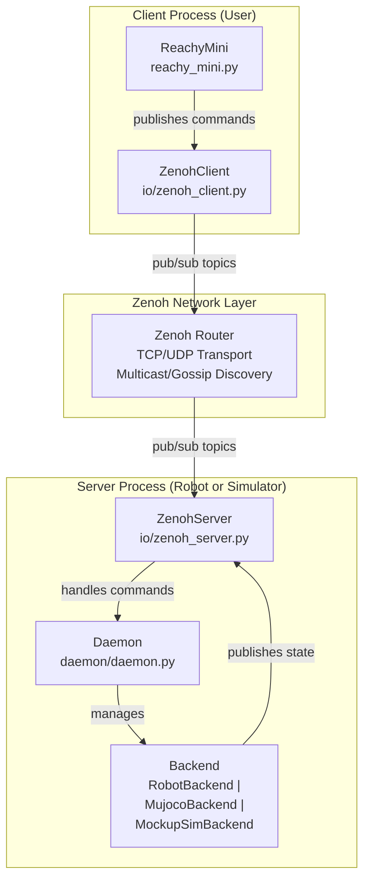

# Reachy Mini Personal Assistant

## Project Overview

The goal of this project was to create a personal assistant using the Reachy Mini robot. The assistant is designed to interact with users through voice commands and provide various services, such as answering questions, controlling smart home devices, and providing information.

To reduce the scope of the initial project, I focused on implementing the following:

- Face tracking: The robot can detect and track faces using its camera, allowing it to maintain eye contact with the user.
- Cron Job Support: The assistant will need to build some knowledge and gather information over time.  To support this, I implemented a cron job type system.  The initial cron jobs scrape calendars(gatech calendar, and create-x) and pulls the 25 new security papers from arxiv.



## Reachy Mini Overview

The Reachy Mini is a small humanoid robot developed by the French company Pollen Robotics. It is designed for research, education, and personal use. The robot features a modular design, allowing users to customize its appearance and functionality. It has a range of sensors, including cameras, and microphones, enabling it to interact with its environment and users effectively.

The Reachy Mini uses a client-server architecture, where the robot runs a server that can be controlled through a client interface.

   1. [Server](https://deepwiki.com/pollen-robotics/reachy_mini/3.3-daemon-service): There is a daemon running on the robot that listens for commands and controls the hardware accordingly. This server can be accessed over a network connection, allowing for remote control and programming.
   2. [Client](https://github.com/pollen-robotics/reachy_mini): Users can create client applications that send commands to the Reachy Mini server.



### [Zenoh](https://zenoh.io/)

I had never head of Zenoh before.  Zenoh stands for Zero Overhead Network Protocol. It is a communication protocol designed for low-latency, high-throughput communication in distributed systems.  It is particularly well-suited for robotics applications, where latency, throughput and power consumption is critical.  Zenoh provides a publish-subscribe model, allowing clients to publish data and subscribe to topics of interest.  It also supports geo-distributed queries, and computations (queryables / map-reduce).

## Reachy Mini Coordinate Systems

Reachy Mini two has two main reference frames:

**Head Frame**: Located at the base of the head.


**World Frame**: Fixed relative to the robot’s base.


## Implementation Details

### Cron Job Creation and Orchestration

For my assistant to be knowledgeable, it needed the ability to gather information over time. To support this, I implemented a cron job type system.

To make this easy for an enduser to create their own custom tasks, I used a few different design patterns.  First, I used the [Registry Pattern](https://www.geeksforgeeks.org/system-design/registry-pattern/) to store all registered cron job.

This was then coupled with the Decorator Pattern and Factory Pattern to allow users to easily create new cron jobs.  By simply adding a decorator to a factory function that returns a `CronJobEntry`, it can be registered as a cron job and scheduled to run at specified intervals.

```python
@cron_job(name="gatech_calendar")
def _register() -> CronJobEntry | None:
    """Register the GaTech calendar scraper job.

    Returns None if calendar_enabled is False, otherwise returns a
    CronJobEntry with the configured scheduler and status.
    """
    settings = CalendarSchedulerConfig()
    if not settings.calendar_enabled:
        return None

    status = ServiceStatus(name="calendar_scheduler", enabled=True)
    store = CalendarStore(settings.calendar_db_path)
    scheduler = CalendarScheduler(
        store=store,
        scraper=Scraper(settings.calendar_excluded_categories),
        interval_seconds=settings.calendar_interval_seconds,
        status=status,
    )
    return CronJobEntry(name="gatech_calendar", scheduler=scheduler, status=status, config=settings)
```

This then allows [jobs.py](../reachy_assistant/services/jobs.py) to manage the lifecycle of all cron jobs, including starting, stopping, and monitoring their status.

## Available Cron Jobs

### Calendar Scrapers

#### GaTech Calendar Scraper

This cron job scrapes the Georgia Tech academic calendar for events and updates the local db with any new events.  To get the calendar events, we first have to get cookies from <https://registrar.gatech.edu/future-academic-calendar> and then we use those cookies to make a xmlhttp request to <https://registrar.gatech.edu/calevents/proxy>.  The response is an XML document containing all calendar events, which we then parse and filter based on categories preferences.

### Create-X Calendar Scraper

Unfortunately the same approach doesn't work for the Create-X calendar, as they don't have a public endpoint for their calendar events.  Instead, I had to scrape the calendar page directly and parse the HTML to extract event information via [BeautifulSoup](https://www.crummy.com/software/BeautifulSoup/bs4/doc/).

### Hive Calendar Scraper

Similar to the Create-X calendar, the Hive calendar also doesn't have a public endpoint for their events.  Hive has an outlook calendar that they embed on their website that requires browser interaction to toggle between different months. To scrape this calendar, I used [Playwright](https://playwright.dev/python/) to automate a headless browser, navigate to the calendar page, and interact with the calendar widget to extract event information.

Because this is resource intensive and fragile, this is not enabled by default.

## Research Paper Scraper

### ArXiv Security and Crypto Paper Scraper

This cron job scrapes the arXiv API for new research papers in the security and crypto categories.  It runs daily and retrieves the latest 25 papers.  This reads an RSS feed from arXiv, parses the XML response, and extracts relevant information such as title, authors, abstract, and publication date.

## Face Tracking
