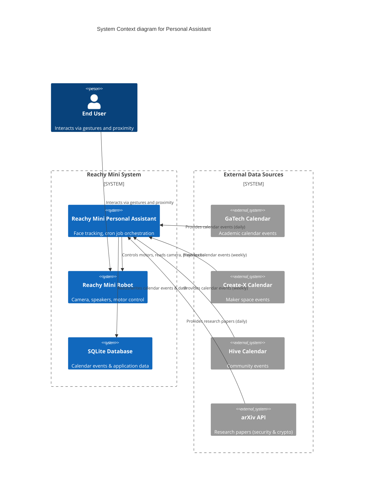
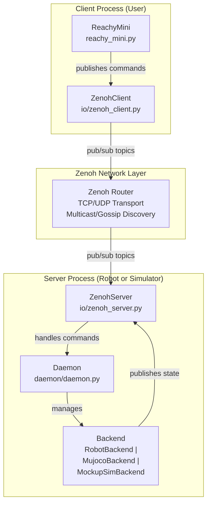
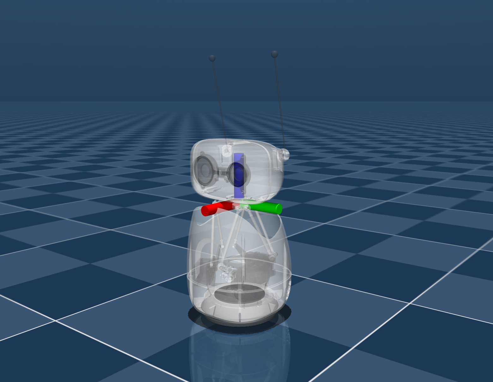
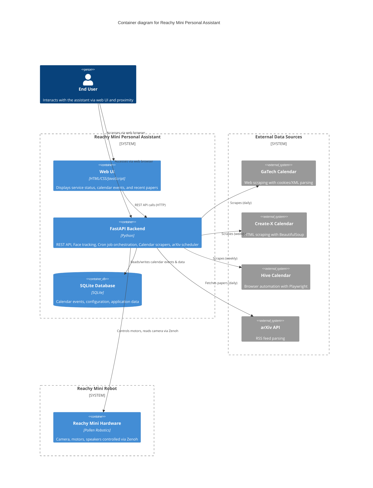
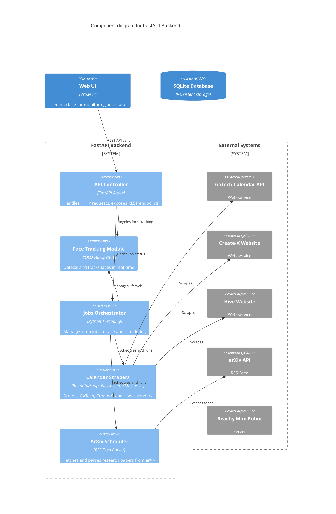

# Reachy Mini Personal Assistant

Video Demo can be found [here](https://www.youtube.com/watch?v=ucMSHPNyIg4).

## Project Overview

The goal of this project was to create a personal assistant using the Reachy Mini robot. The assistant is designed to interact with users through voice commands and provide various services, such as answering questions, controlling smart home devices, and providing information.

To reduce the scope of the initial project, I focused on implementing the following:

- Face tracking: The robot can detect and track faces using its camera, allowing it to maintain eye contact with the user.
- Cron Job Support: The assistant will need to build some knowledge and gather information over time.  To support this, I implemented a cron job type system.  The initial cron jobs scrape calendars(gatech calendar, and create-x) and pulls the 25 new security papers from arxiv.



## Reachy Mini Overview

The Reachy Mini is a small humanoid robot developed by the French company Pollen Robotics. It is designed for research, education, and personal use. The robot features a modular design, allowing users to customize its appearance and functionality. It has a range of sensors, including cameras, and microphones, enabling it to interact with its environment and users effectively.

The Reachy Mini uses a client-server architecture, where the robot runs a server that can be controlled through a client interface.

   1. [Server](https://deepwiki.com/pollen-robotics/reachy_mini/3.3-daemon-service): There is a daemon running on the robot that listens for commands and controls the hardware accordingly. This server can be accessed over a network connection, allowing for remote control and programming.
   2. [Client](https://github.com/pollen-robotics/reachy_mini): Users can create client applications that send commands to the Reachy Mini server.



### [Zenoh](https://zenoh.io/)

I had never head of Zenoh before.  Zenoh stands for Zero Overhead Network Protocol. It is a communication protocol designed for low-latency, high-throughput communication in distributed systems.  It is particularly well-suited for robotics applications, where latency, throughput and power consumption is critical.  Zenoh provides a publish-subscribe model, allowing clients to publish data and subscribe to topics of interest.  It also supports geo-distributed queries, and computations (queryables / map-reduce).

## Reachy Mini Coordinate Systems

Reachy Mini two has two main reference frames:

**Head Frame**: Located at the base of the head.


**World Frame**: Fixed relative to the robot's base.


## Implementation Details

### Assistant Container Architecture



### Backend Component Diagram




### Cron Job Creation and Orchestration

For my assistant to be knowledgeable, it needed the ability to gather information over time. To support this, I implemented a cron job type system.

To make this easy for an enduser to create their own custom tasks, I used a few different design patterns.  First, I used the [Registry Pattern](https://www.geeksforgeeks.org/system-design/registry-pattern/) to store all registered cron job.

This was then coupled with the Decorator Pattern and Factory Pattern to allow users to easily create new cron jobs.  By simply adding a decorator to a factory function that returns a `CronJobEntry`, it can be registered as a cron job and scheduled to run at specified intervals.

```python
@cron_job(name="gatech_calendar")
def _register() -> CronJobEntry | None:
    """Register the GaTech calendar scraper job.

    Returns None if calendar_enabled is False, otherwise returns a
    CronJobEntry with the configured scheduler and status.
    """
    settings = CalendarSchedulerConfig()
    if not settings.calendar_enabled:
        return None

    status = ServiceStatus(name="calendar_scheduler", enabled=True)
    store = CalendarStore(settings.calendar_db_path)
    scheduler = CalendarScheduler(
        store=store,
        scraper=Scraper(settings.calendar_excluded_categories),
        interval_seconds=settings.calendar_interval_seconds,
        status=status,
    )
    return CronJobEntry(name="gatech_calendar", scheduler=scheduler, status=status, config=settings)
```

```python
@cron_job(name="arxiv_papers")
def _register() -> CronJobEntry:
    """Register the arXiv papers scraper job.

    Returns:
        CronJobEntry with the configured scheduler and status.
    """
    status = ServiceStatus(name="arxiv_scheduler", enabled=True)
    scheduler = ArxivScheduler(interval_seconds=ONE_DAY_SECONDS, status=status)

    router = APIRouter()

    @router.get("/papers")
    def get_papers(limit: int = 25):  # noqa: ANN202
        """Return the latest crypto/security papers from arXiv.

        Args:
            limit: Maximum number of papers to return (default 25).

        Returns:
            A dictionary with paper count and list of paper objects.
        """
        papers = scheduler.latest_papers[:limit]
        return {
            "limit": limit,
            "count": len(papers),
            "papers": [
                {
                    "title": p.title,
                    "authors": p.authors,
                    "published": p.published,
                    "arxiv_id": p.arxiv_id,
                    "summary": p.summary,
                    "link": p.link,
                    "pdf_link": p.pdf_link,
                }
                for p in papers
            ],
        }

    return CronJobEntry(name="arxiv_papers", scheduler=scheduler, status=status, router=router)
```

This then allows [jobs.py](../reachy_assistant/services/jobs.py) to manage the lifecycle of all cron jobs, including starting, stopping, and monitoring their status.

## Available Cron Jobs

### Calendar Scrapers

#### GaTech Calendar Scraper

This cron job scrapes the Georgia Tech academic calendar for events and updates the local db with any new events.  To get the calendar events, we first have to get cookies from <https://registrar.gatech.edu/future-academic-calendar> and then we use those cookies to make a xmlhttp request to <https://registrar.gatech.edu/calevents/proxy>.  The response is an XML document containing all calendar events, which we then parse and filter based on categories preferences.

### Create-X Calendar Scraper

Unfortunately the same approach doesn't work for the Create-X calendar, as they don't have a public endpoint for their calendar events.  Instead, I had to scrape the calendar page directly and parse the HTML to extract event information via [BeautifulSoup](https://www.crummy.com/software/BeautifulSoup/bs4/doc/).

### Hive Calendar Scraper

Similar to the Create-X calendar, the Hive calendar also doesn't have a public endpoint for their events.  Hive has an outlook calendar that they embed on their website that requires browser interaction to toggle between different months. To scrape this calendar, I used [Playwright](https://playwright.dev/python/) to automate a headless browser, navigate to the calendar page, and interact with the calendar widget to extract event information.

Because this is resource intensive and fragile, this is not enabled by default.

## Research Paper Scraper

### ArXiv Security and Crypto Paper Scraper

This cron job scrapes the arXiv API for new research papers in the security and crypto categories.  It runs daily and retrieves the latest 25 papers.  This reads an RSS feed from arXiv, parses the XML response, and extracts relevant information such as title, authors, abstract, and publication date.

## Face Tracking

The face tracking functionality uses the Reachy Mini's camera to detect and track faces in real-time. I tried several a few different models to try to balance accuracy and performance, including YOLO26 and RF-DTR Nano. Even though both of these models advertise they are for edge devices, the lag was pretty severe with these models.

Trying to use [RF-DTR Nano](https://rfdetr.roboflow.com/latest/learn/run/detection/) installed too many dependencies that filled up the disk space. YOLO26 was able to run, but the lag is pretty severe even after I applied the suggested optimizations from [Ultralytics](https://docs.ultralytics.com/guides/raspberry-pi/) including converting the model to ONNX format, and reducing the image size used at inference time.


When the model is run, it returns the class of the object detected, the confidence level of that detection, and the bounding box coordinates of the detected object. I then use this information to determine if a face is detected and where it is in the camera frame. I find the center of the bounding box and calculate the offset from the center of the frame to determine which direction the robot should move its head to track the face.

The robot can then use this information to pan and tilt its head to keep the face centered in the camera frame, providing the appearance of maintaining eye contact with the user.

## Concepts Covered in Class

- **Multi-threading**

Each cron job is started in its own thread using [Threading.Timer](https://docs.python.org/3/library/threading.html#timer-objects). This allows the assistant to run multiple cron jobs concurrently without blocking the main application thread on a schedule.  I also use [Threading.Events](https://docs.python.org/3/library/threading.html#event-objects) to signal when a cron job should stop, allowing for graceful shutdowns.

- **World Cordinates and Transformations**

We learned about cordinates and transformations in OpenGL, and with the Reachy Mini, we saw we have two different coordinate systems - the head frame and the world frame.  To calculate how the robot should move its head to track a face, we need to perform transformations between these coordinate systems.  For this project, we focused only on the head position.

- **MakeFile**

Because CMakefiles were so fun, I have added support for a Makefile to help with common commands.

```shell
make help
  help                           Shows all targets and help from the Makefile (this message).
  npm/audit-fix                  Automatically fix npm vulnerabilities
  npm/audit                      Check for npm vulnerabilities
  npm/outdated                   Show outdated npm packages
  npm/update                     Update npm packages to latest versions within semver constraints
  npm/upgrade                    Upgrade all packages to latest major versions
  pre-commit/autoupdate          Update pre-commit hook versions
  pre-commit/gc                  Clean unused cached repos.
  pre-commit/install             Install pre-commit hooks
  pre-commit/remove-cache        Remove all of pre-commit's cache
  pre-commit/run                 Manually run pre-commit
  python/install                 Install Python dependencies
  python/lint-check              Run Python linters (flake8 and black)
  python/lock-check              Check if Python dependencies are up to date with lockfile
  python/lock                    Lock Python dependencies
  python/outdated                Show outdated Python packages
  python/ruff-fix                Automatically fix Python code with ruff
  python/ruff-format             Automatically format Python code with ruff
  python/unit-tests              Run Python unit tests with coverage
  reachy/sim                     Run the Reachy simulator
  security/all                   Run all security targets
  security/bandit                Run Bandit for Med/High Static Analysis testing
  security/dependency            Check if dependencies contain any vulnerabilities
  security/sast                  Run Static Analysis testing
  security/secrets-audit         Audit Detect Secrets baseline file
  security/secrets-ci            CI step to audit Detect Secrets baseline file, fails if any unverified secrets
  security/secrets               Run Detect Secrets to find hardcoded secrets
  security/semgrep               Run Semgrep Static Analysis testing
  semantic-release/dry-run       Perform a dry-run of semantic-release (no changes made)
  semantic-release/install       Install semantic-release dependencies (nvm use + npm install)
  semantic-release/publish       Publish a release using semantic-release
```

- **Sockets**

While we didn't write any socket code directly, we know that the HTTP requests we are using to gather information in the cron jobs are using TCP sockets under the hood.  We also know that the WebRTC support that the Reachy Mini Server provides for the client, uses UDP sockets.

- **Design Patterns**

I reiterated on the design of certain components like the cron jobs and the class provided a helpful reminder of design patterns I was already using or ended up migrating to.

- **ML/GPU**

While I didn't have a GPU at the time, it was a painful reminder why a lot of ML models require GPUs to run effectively.  Even with the optimizations I applied, the face tracking model still had significant lag when running on a CPU.  This experience highlighted the importance of hardware acceleration for ML workloads and the challenges of running complex models on resource-constrained devices.

## Other Misc Notes

This repo also implemented the following:
- **Semantic Release**: I set up semantic release to automate the release process.  By following conventional commit messages, we can automatically generate changelogs
- **Pre-commit hooks**: I set up pre-commit hooks to enforce code quality and consistency.  This includes running linters, formatters, and security checks before allowing commits to be made.
- **Security Checks**: I implemented several security checks, including Bandit for static analysis, dependency vulnerability checks, and Detect Secrets for finding hardcoded secrets in the codebase.
- **CI Integration**: I set up GitHub Actions to run tests, install dependencies, and security checks on every push to the repository, ensuring that code quality is maintained and potential issues are caught early in the development process.
- **Unit Tests**: I wrote unit tests for critical components of the backend, such as the cron job schedulers and scrapers, to ensure that they function correctly and to facilitate future refactoring and maintenance.

This repo currently has a 67% code coverage
```shell
_____________________________________________________________ coverage: platform darwin, python 3.12.13-final-0 ______________________________________________________________

Name                                                       Stmts   Miss  Cover
------------------------------------------------------------------------------
reachy_assistant/__init__.py                                   2      0   100%
reachy_assistant/log_config.py                                 3      0   100%
reachy_assistant/main.py                                      26      3    88%
reachy_assistant/services/__init__.py                          3      0   100%
reachy_assistant/services/calendars/__init__.py                9      3    67%
reachy_assistant/services/calendars/api.py                    12      7    42%
reachy_assistant/services/calendars/create_x/__init__.py       2      0   100%
reachy_assistant/services/calendars/create_x/scraper.py       65     11    83%
reachy_assistant/services/calendars/event.py                  29      3    90%
reachy_assistant/services/calendars/gatech/__init__.py         2      0   100%
reachy_assistant/services/calendars/gatech/event.py           21      0   100%
reachy_assistant/services/calendars/gatech/scraper.py         66     25    62%
reachy_assistant/services/calendars/hive/__init__.py           2      0   100%
reachy_assistant/services/calendars/scheduler.py              38     13    66%
reachy_assistant/services/calendars/scraper.py                 6      1    83%
reachy_assistant/services/calendars/store.py                  66     22    67%
reachy_assistant/services/jobs.py                             40     15    62%
reachy_assistant/services/registry.py                         39      2    95%
reachy_assistant/services/research/__init__.py                 2      0   100%
reachy_assistant/services/research/arxiv.py                   66     36    45%
reachy_assistant/services/scheduler.py                        29     17    41%
reachy_assistant/services/status.py                           43      0   100%
reachy_assistant/settings.py                                  14      0   100%
reachy_assistant/tracker.py                                   73     58    21%
------------------------------------------------------------------------------
TOTAL                                                        658    216    67%
====================================================================== 89 passed, 15 warnings in 6.18s =======================================================================
✓ Unit tests completed
```